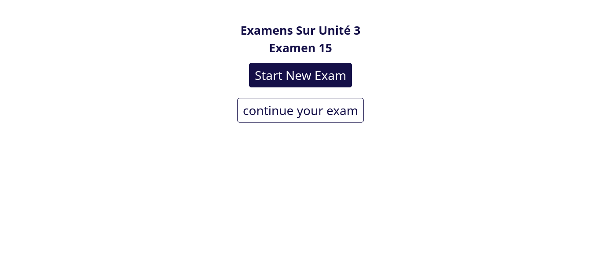
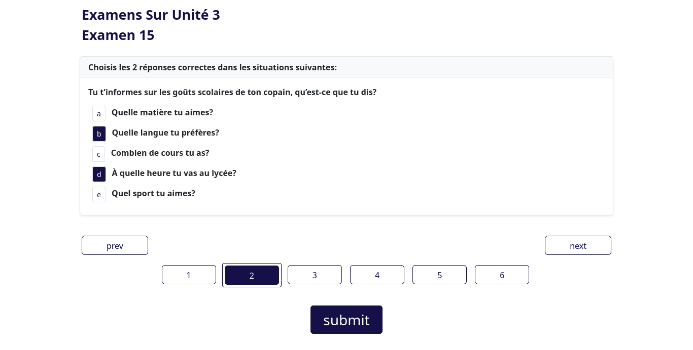
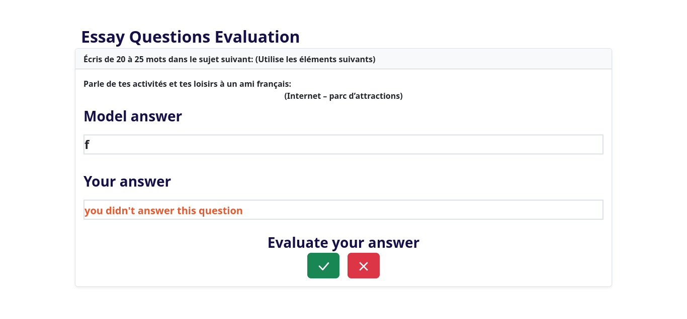
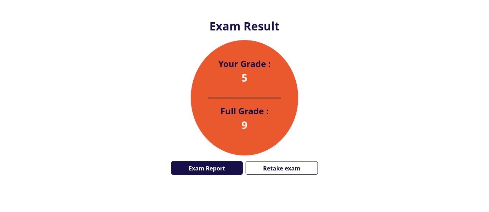
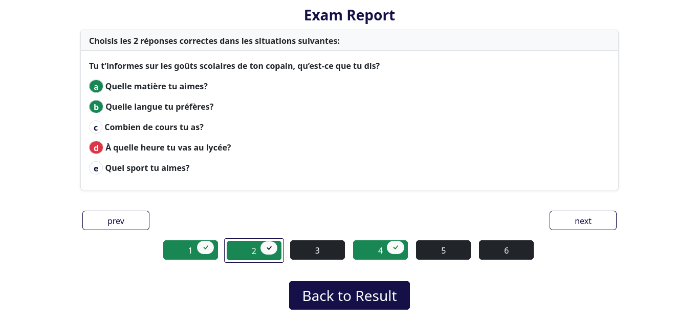
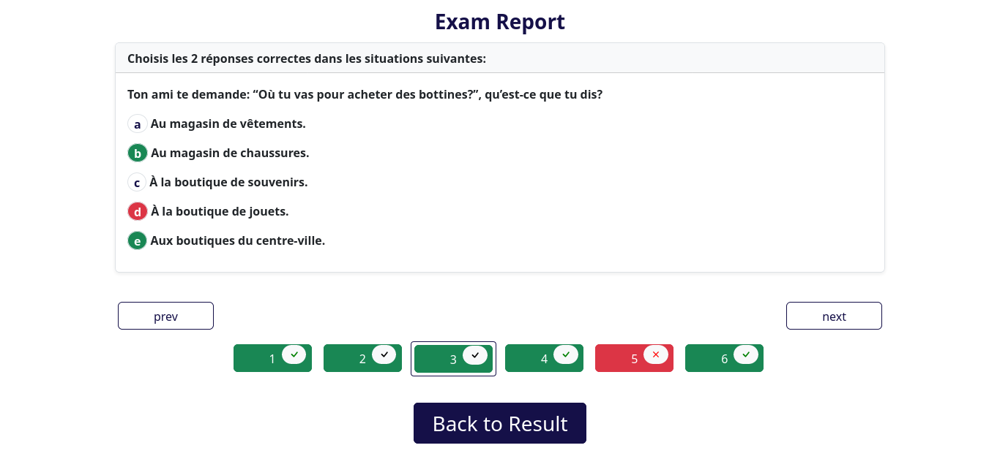

# Exam Web Application

> Exam Web Application\*\* is a React application designed to provide a platform for conducting online exams. Users can take exams with various question types, and view their results.
> Live demo [_here_](https://exam-task.onrender.com/).

## Table of Contents

- [Features](#features)
- [Technologies Used](#technologies-used)
- [Screenshots](#screenshots)

## Features

- Question types: multiple choice, MCQ, essay
- Exam history and results

## Technologies Used

#### Front-end

- React: JavaScript library for building user interfaces
- React Router DOM: Routing library for navigation within the React app
- Redux Toolkit: State management library
- SCSS: Preprocessor for styling with extended CSS syntax
- Bootstrap: CSS framework for responsive design

## Screenshots

<!-- If you have screenshots you'd like to share, include them here. -->
